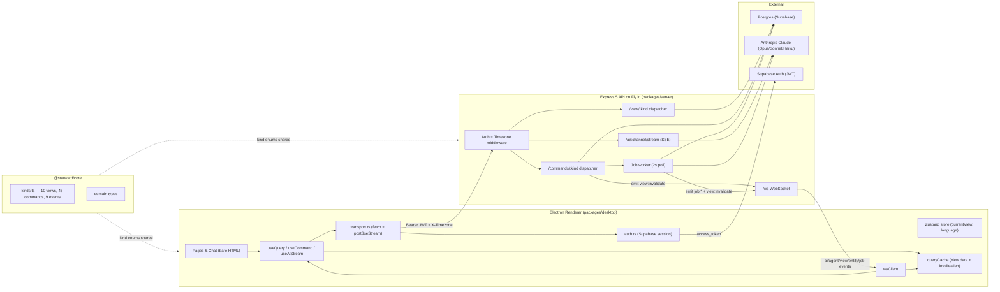
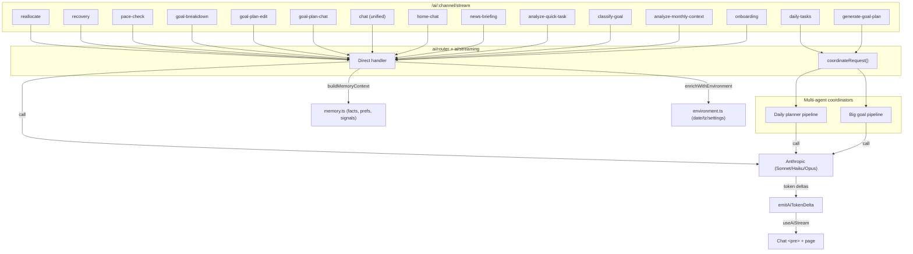
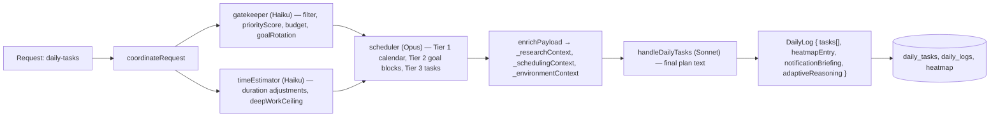
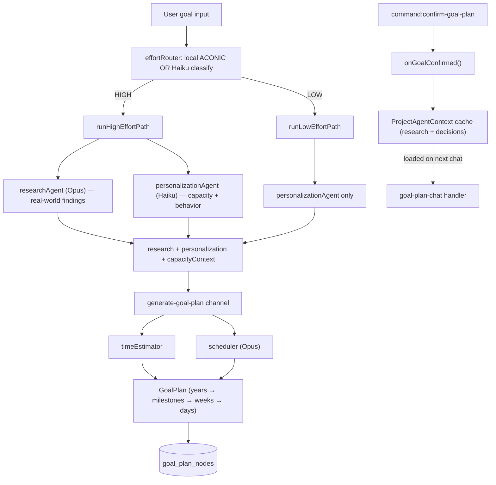
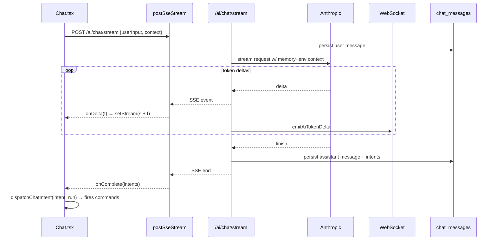
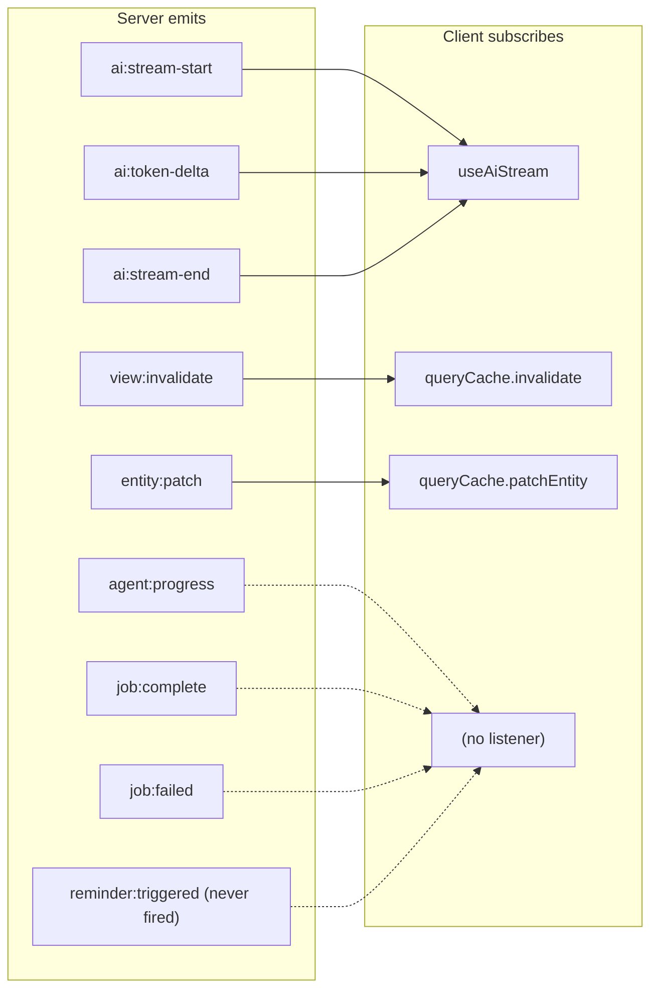
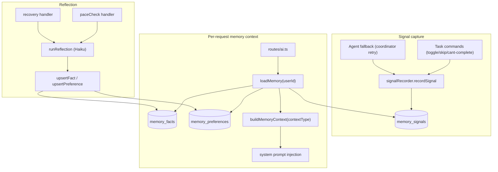

# Starward — Feature Flow Diagrams & Audit Report

**Audit date:** 2026-04-19
**Scope:** `Client - Future-Planner/packages/{core,server,desktop}`
**Renderer mode:** bare-HTML test harness (every view + command reachable from plain `<button>`/`<textarea>`)

This file is the output of a four-phase audit. Every feature is traced end-to-end: renderer → transport → auth → server → domain logic → AI → persistence → WebSocket → cache.

For a higher-level overview of the app structure, see `APP_STRUCTURE.md`. For the additive AI/agent layers (RAG, critique, queue, scheduler, tool-use) that sit on top of the core architecture, see `ARCHITECTURE_UPGRADES.md`.

---

## 0. Top-Level Topology



---

## 1. Protocol Surface — Wiring Status

| Kind family | Count | Fully wired | Notes / flags |
|---|---|---|---|
| **QueryKind** | 10 | 10/10 resolvers in `views/index.ts` | `view:dashboard` + `view:goal-breakdown` resolve server-side but have **no page in the bare-HTML harness** |
| **CommandKind** | 43 | 43/43 switch branches in `routes/commands.ts` | `heal-all-goal-plans` handler exists but is **not declared in `kinds.ts`** (typed via `as CommandKind` cast) |
| **Async commands** | 3 | `regenerate-goal-plan`, `adaptive-reschedule`, `adjust-all-overloaded-plans` (job worker) | Return `{ok, jobId, async:true}` |
| **Invalidation map** | 43 | 43/43 in `views/_invalidation.ts` commandToInvalidations | `reset-data` invalidates all kinds |
| **EventKind** | 9 | 8 emitted, 1 dormant | `reminder:triggered` type defined but **no server emitter** (reminder UI currently polls instead) |
| **WS barrel exports** | — | missing `emitJobComplete`, `emitJobFailed`, `emitEntityPatch` | Bug: `ws/index.ts` barrel does not re-export these three; direct import from `ws/events.ts` works but is inconsistent |

---

## 2. CQRS Request Loop

```mermaid
sequenceDiagram
  autonumber
  participant UI as Page (bare HTML)
  participant uQ as useQuery
  participant uC as useCommand
  participant QC as queryCache
  participant TX as transport.ts
  participant Auth as auth.ts
  participant SRV as Express server
  participant DB as Postgres
  participant WS as WebSocket

  UI->>uQ: useQuery("view:tasks")
  uQ->>QC: get cached?
  alt cache miss or stale
    uQ->>TX: GET /view/tasks
    TX->>Auth: getAuthToken()
    TX->>SRV: + Authorization + X-Timezone
    SRV->>DB: resolveTasksView(userId)
    DB-->>SRV: rows
    SRV-->>TX: { data }
    TX-->>QC: cache.set("view:tasks", data)
  end
  QC-->>UI: render &lt;pre&gt;JSON&lt;/pre&gt;

  UI->>uC: run("command:toggle-task", {taskId})
  uC->>TX: POST /commands/toggle-task
  TX->>SRV: envelope
  SRV->>DB: UPDATE daily_tasks
  SRV->>WS: emitEntityPatch(userId, {...})
  SRV->>WS: emitViewInvalidate(userId, [view:tasks, view:dashboard, ...])
  SRV-->>uC: { ok: true }
  WS-->>QC: entity:patch → cachePatchEntity (instant)
  WS-->>QC: view:invalidate → mark stale
  QC-->>uQ: trigger refetch
  uQ->>TX: GET /view/tasks (fresh)
```

---

## 3. Async Command via Job Worker

Three commands execute asynchronously: `regenerate-goal-plan`, `adaptive-reschedule`, `adjust-all-overloaded-plans`.

```mermaid
sequenceDiagram
  participant UI
  participant CR as /commands/:kind
  participant JQ as job_queue (Postgres)
  participant JW as job-worker (2s poll)
  participant HN as Handler (lazy import)
  participant WS as WebSocket

  UI->>CR: POST /commands/regenerate-goal-plan
  CR->>JQ: insertJob(userId, "regenerate-goal-plan", payload)
  CR-->>UI: { ok: true, jobId, async: true }

  loop every 2s
    JW->>JQ: SELECT ... FOR UPDATE SKIP LOCKED
    JQ-->>JW: claim pending job
  end

  JW->>HN: dynamic import cmdRegenerateGoalPlan
  HN->>HN: run Anthropic calls + DB writes
  alt success
    HN-->>JW: result
    JW->>JQ: UPDATE status='completed'
    JW->>WS: emitJobComplete + emitViewInvalidate
  else failure
    HN-->>JW: error
    JW->>JQ: UPDATE retry_count; status='pending'|'failed'
    JW->>WS: emitJobFailed
  end
```

> ⚠️ Client has no listener for `job:complete` / `job:failed`; UI relies on the paired `view:invalidate` to auto-refetch. Add listeners if you want toast-style completion feedback.

---

## 4. AI SSE Pipelines — 15 Channels



### 4a. Daily Planner Pipeline (`daily-tasks` channel)



Downstream scenarios (`coordinators/dailyPlanner/scenarios.ts`):
- `pool-integration` — integrate newly added pending tasks
- `bonus-suggest` — refresh with no pool → suggest bonus tasks
- `full-generation` — empty day → full regen
- `collect-and-schedule` — cross-goal deferral

Helpers: `memoryPackager`, `taskRotation`, `cantCompleteRouter`.

### 4b. Big Goal Pipeline



### 4c. Chat Streaming (home-chat + goal-plan-chat)



---

## 5. WebSocket Event Bus



**Flags:**
- `reminder:triggered` declared but no server caller. Client polls `view:tasks` every 30s in `useReminderNotifications` instead.
- `agent:progress`, `job:complete`, `job:failed` emitted server-side, no client listener.
- `ws/index.ts` barrel omits `emitJobComplete`, `emitJobFailed`, `emitEntityPatch`.

---

## 6. Auth + Transport

```mermaid
sequenceDiagram
  participant UI as LoginPage
  participant SBX as Supabase SDK
  participant AUTH as auth.ts
  participant TX as transport.ts
  participant WS as wsClient.ts
  participant MW as server/middleware/auth.ts

  UI->>SBX: signInWithPassword | signUp | signInWithOAuth("google")
  SBX-->>AUTH: session { access_token }
  AUTH-->>UI: AuthContext.session
  Note over UI: AuthGuard renders children

  UI->>TX: fetchEnvelope()
  TX->>AUTH: getAuthToken()
  TX->>MW: Authorization: Bearer + X-Timezone
  MW->>MW: verify JWT → req.userId
  MW-->>TX: next()

  UI->>WS: wsClient.connect()
  WS->>MW: upgrade with ?token=&lt;jwt&gt;
  MW-->>WS: accept + register connection
  WS->>WS: heartbeat 25s, reconnect on token rotation
```

Electron OAuth (Google): LoginPage → `window.electronAuth?.oauthPopup(url)` → main process opens browser → deep-link → Supabase session.

---

## 7. Memory + Reflection



Deferred (code present but not called): `shouldAutoReflect()`, `generateNudges()`.

---

## 8. Per-Feature End-to-End Map

| # | Feature | Client page / entry | View read | Command(s) | AI channel(s) | Key tables |
|---|---|---|---|---|---|---|
| 1 | Email/password login | `pages/auth/LoginPage.tsx` | — | — | — | Supabase Auth |
| 2 | Google OAuth | LoginPage → `electronAuth.oauthPopup` | — | — | — | Supabase Auth |
| 3 | Signup | LoginPage (mode toggle) | — | — | — | Supabase Auth |
| 4 | Session bootstrap | `AuthGuard` → `AuthContext` | `view:onboarding` | — | — | users |
| 5 | Onboarding | `pages/onboarding/OnboardingPage.tsx` | `view:onboarding` | `complete-onboarding`, `update-settings` | `onboarding` | users, user_settings |
| 6 | Goal creation | `pages/goals/PlanningPage.tsx` | `view:planning` | `create-goal`, `update-goal`, `delete-goal` | `classify-goal`, `goal-breakdown` | goals |
| 7 | Goal plan view | `pages/goals/GoalPlanPage.tsx` | `view:goal-plan` | `confirm-goal-plan`, `add-task-to-plan`, `expand-plan-week` | `goal-plan-chat`, `goal-plan-edit` | goal_plan_nodes |
| 8 | Goal plan regenerate | GoalPlanPage | — | `regenerate-goal-plan` *(async)* | `generate-goal-plan` | goal_plan_nodes, job_queue |
| 9 | Adaptive reschedule | GoalPlanPage | — | `adaptive-reschedule` *(async)* | (coordinator) | goal_plan_nodes, daily_tasks, job_queue |
| 10 | Reallocate plan | GoalPlanPage | — | `reallocate-goal-plan` | `reallocate` | goal_plan_nodes |
| 11 | Adjust all overloaded | PlanningPage / GoalPlanPage | — | `adjust-all-overloaded-plans` *(async)* | (coordinator) | goal_plan_nodes, job_queue |
| 12 | Monthly context | PlanningPage | `view:planning` | `save-monthly-context`, `delete-monthly-context` | `analyze-monthly-context` | monthly_context |
| 13 | Vacation mode | PlanningPage | `view:planning` | `set-vacation-mode` | — | vacation_mode |
| 14 | Daily tasks — confirm | `pages/tasks/TasksPage.tsx` | `view:tasks` | `confirm-daily-tasks` | — | daily_tasks |
| 15 | Daily tasks — refresh | TasksPage | — | `refresh-daily-plan` | `daily-tasks` pipeline | daily_tasks, daily_logs |
| 16 | Daily tasks — regenerate | TasksPage | — | `regenerate-daily-tasks` | `daily-tasks` | daily_tasks |
| 17 | Bonus task | TasksPage | — | `generate-bonus-task` | `daily-tasks` scenario | daily_tasks |
| 18 | Toggle / skip / delete task | TasksPage / CalendarPage | `view:tasks` / `view:calendar` | `toggle-task`, `skip-task`, `delete-task` | — | daily_tasks |
| 19 | Update task | TasksPage / CalendarPage | — | `update-task` | — | daily_tasks |
| 20 | Reschedule task | TasksPage | — | `reschedule-task` | — | daily_tasks |
| 21 | Can't complete | TasksPage | — | `cant-complete-task` | `recovery` | daily_tasks, memory_signals |
| 22 | Task proposal accept | TasksPage | — | `accept-task-proposal` | `analyze-quick-task` | pending_tasks, daily_tasks |
| 23 | Pending tasks | TasksPage | — | `create/confirm/reject-pending-task` | `analyze-quick-task` | pending_tasks |
| 24 | Defer overflow / undo | TasksPage | — | `defer-overflow`, `undo-defer` | — | daily_tasks |
| 25 | Snooze / dismiss reschedule | TasksPage | — | `snooze-reschedule`, `dismiss-reschedule` | — | daily_tasks |
| 26 | Delete tasks for date | TasksPage | — | `delete-tasks-for-date` | — | daily_tasks |
| 27 | Reminders | TasksPage | `view:tasks` | `upsert-reminder`, `acknowledge-reminder`, `delete-reminder(s-batch)` | — | reminders |
| 28 | Reminder trigger | `hooks/useReminderNotifications` | polls every 30s | — | — | reminders |
| 29 | Nudges | TasksPage | `view:tasks` | `dismiss-nudge` | (reflection — deferred) | nudges |
| 30 | Pace check | (server-driven) | `view:goal-plan` | — | `pace-check` → `runReflection` | memory_facts |
| 31 | Calendar | `pages/calendar/CalendarPage.tsx` | `view:calendar` | `create/update/delete/toggle-task` | — | daily_tasks |
| 32 | Roadmap | `pages/roadmap/RoadmapPage.tsx` | `view:roadmap` | — | — | goals, goal_plan_nodes |
| 33 | News feed | `pages/news/NewsFeedPage.tsx` | `view:news-feed` | — | `news-briefing` | news_briefings |
| 34 | Settings | `pages/settings/SettingsPage.tsx` | `view:settings` | `update-settings`, `reset-data` | — | user_settings |
| 35 | Weekly availability | SettingsPage (JSON textarea) | `view:settings` | `update-settings` | — | user_settings |
| 36 | Home chat | `components/Chat.tsx` | — | `clear-home-chat`, `send-chat-message`, `start-chat-stream` | `home-chat`, `chat` | home_chat_messages |
| 37 | Chat intent dispatch | Chat.tsx → `dispatchChatIntent(run)` | — | any command server emits | — | — |
| 38 | View refresh loop | `useQuery` + WS | all | — | — | queryCache |
| 39 | Entity patch (fast path) | `queryCache.patchEntity` | — | `toggle-task` emits `entity:patch` | — | — |
| 40 | Dashboard view | ⚠️ **no harness page** | `view:dashboard` | — | — | daily_tasks, goals |
| 41 | Goal breakdown view | ⚠️ **no harness page** | `view:goal-breakdown` | — | `goal-breakdown` | goals |

---

## 9. Gaps & Fixes

1. **`reminder:triggered` never emitted server-side.** Type and emitter exist; no scheduler calls it. Client polls `view:tasks` every 30s. Either wire a tick to `emitReminderTriggered()` or drop the declaration.

2. **`heal-all-goal-plans` not in `kinds.ts`.** Dispatched via an `as CommandKind` cast at `routes/commands.ts:241`. Add to `CommandKinds` or remove the handler.

3. **`ws/index.ts` barrel incomplete.** Missing `emitJobComplete`, `emitJobFailed`, `emitEntityPatch`. Call sites import directly from `ws/events.ts`.

4. **No client listener for `job:complete` / `job:failed` / `agent:progress`.** Paired `view:invalidate` refreshes state, but no completion feedback.

5. **`view:dashboard` and `view:goal-breakdown` have no harness page.** Add minimal `<pre>` dump pages to exercise both resolvers.

6. **Deferred reflection hooks.** `shouldAutoReflect()` and `generateNudges()` declared but never called.

---

## 10. Verification Checklist

- [ ] `cd packages/desktop && npm run typecheck` → clean
- [ ] `cd packages/server && npm run build` → clean
- [ ] `npm run electron:dev` → LoginPage renders, Supabase login works, `[ws] connected` in devtools
- [ ] Click every nav button — each page prints a non-error `<pre>` JSON dump
- [ ] Spot-check one command per domain:
  - `toggle-task` (TasksPage) → `entity:patch` flips row
  - `create-goal` (PlanningPage) → `view:invalidate` refetches
  - `adaptive-reschedule` (GoalPlanPage) → job enqueued, `view:goal-plan` refetches after worker tick
  - `update-settings` (SettingsPage) → `view:settings` reflects change
  - Chat textarea → `<pre>` fills with token deltas, intents dispatch commands
